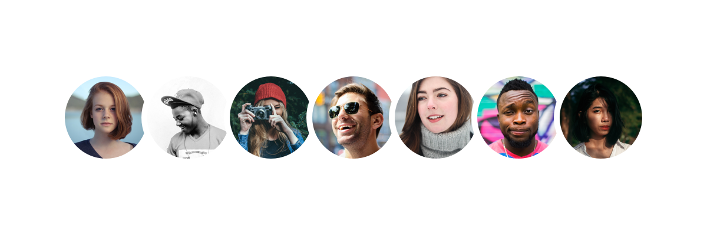

#inter-faces

This download contains 30 images of people that can be applied as avatars for UI mockups, the web, user personas, etc. Use them for whatever you like, free.

All images are sourced from [Pexels](https://www.pexels.com) and have been cropped and resized to 1000px and 500px variants.

A credits file has been included with links to the original images. There you will find the ability to support the photographer with a donation.

### License

>All avatars are licensed under the **Creative Commons Zero (CC0) license**. This means the pictures are completely free to be used for any legal purpose.

>- The pictures are **free** for personal and even for commercial use.
- You can modify, copy and distribute the photos.
- All without asking for permission or setting a link to the source. So, **attribution is not required**.

>The only restriction is that identifiable people may not appear in a bad light or in a way that they may find offensive, unless they give their consent.

>The CC0 license was released by the non-profit organization Creative Commons (CC). Get more information about Creative Commons images and the license on the [official license page](https://creativecommons.org/publicdomain/zero/1.0/).

